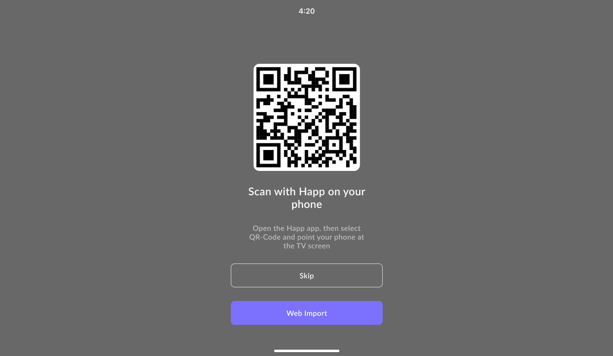

# Android TV



<figure><figcaption></figcaption></figure>



<figure><figcaption></figcaption></figure>



The Happ app on Android TV is the same as the mobile app and can be installed via APK or through Google Play.

At the first launch, the app will offer to add a subscription over the local network using a QR code. Simply scan the QR code with the Happ mobile app on iOS or Android, after which your phone will try to transfer the selected servers or subscription to the TV. If this local network transfer fails, the app will suggest sending the subscription via the internet.

Additionally, it is possible to remotely transfer a subscription or server configuration to the TV through the website [tv.happ.su](https://tv.happ.su/) or the [API](../dev-docs/android-tv-api.md). On the TV, select the **Web Import** option and enter the displayed code or scan the QR code and open the link in your phone’s browser.
